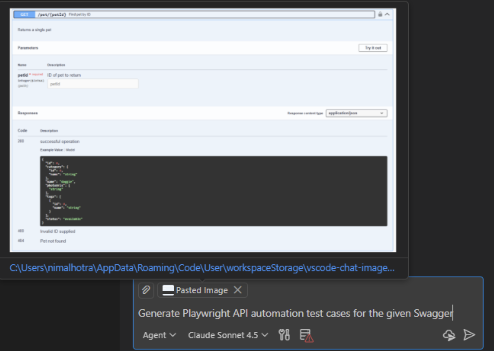
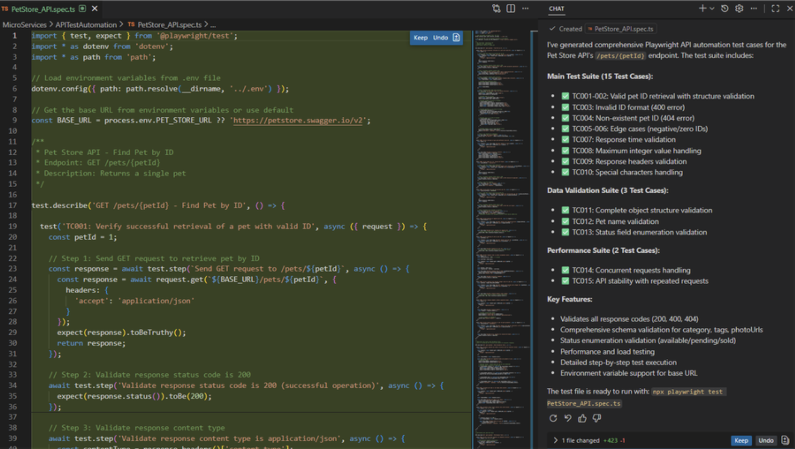
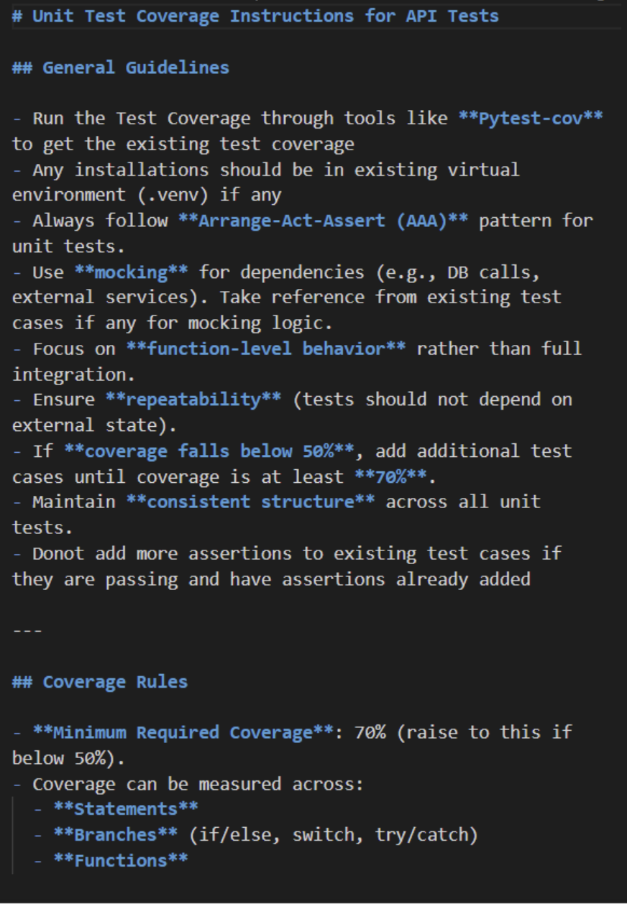

# Week 9 Raw Guidelines: Testing / QA

**Authors:** Liliana Hotsko, Alina Lytovchenko, Sofiia Tkach, Zesheng(Ethan) Jia
**Readings Assigned:**  
* Software Testing With Large Language Models: Survey, Landscape, and Vision [1]
* On the Evaluation of Large Language Models in Unit Test Generation [2]
* Software Testing with Large Language Models: An Interview Study with Practitioners [3]
* Using Large Language Models to Generate JUnit Tests: An Empirical Study [4]
* Evaluating and Improving ChatGPT for Unit Test Generation [5]
* Large Language Models for Software Testing: A Research Roadmap [6]

## 1. Guidelines from Readings
### Guideline 1.1: Explicitly Request Boundary and Negative Test Cases

**Description:**  
Do not rely on the LLM to independently enumerate edge cases. In the prompt, explicitly require categories of non-happy-path tests and (ideally) minimum counts. At a minimum, request:

* Boundary values: min/max, zero, empty string/collection, single-element, off-by-one
* Null / missing inputs: null, absent keys/fields, optional values missing
* Invalid formats: malformed JSON/CSV, invalid dates, illegal enum values, wrong encoding
* Exception/error paths: inputs that must trigger validation failures or thrown exceptions
* State/contract violations: precondition breaches, invalid state transitions (if applicable)

**Reasoning:**  
LLMs default to generating "happy-path" tests first and often fail to invent the weird or extreme inputs that trigger validation errors and exception branches. Yuan et al. [5] show that ChatGPT-generated tests suffer from low branch coverage precisely because edge cases are not exercised; Yang et al. [2] confirm that LLM-generated test suites miss many bugs due to insufficient boundary and null-input coverage. Wang et al. [1] further note that prompt design choices — including whether edge-case categories are named explicitly — are among the strongest determinants of final test quality.

**Example:**

*Good prompt:*
```
"Generate JUnit 5 unit tests for `parseInvoice(String json)`.

Required categories (at least 2 tests each):
1. Boundary: empty string, very large numeric fields, empty items list
2. Null/Missing: missing required keys (`invoiceId`, `items`), null values where allowed/disallowed
3. InvalidFormat: malformed JSON, wrong field types (string instead of number)
4. ExceptionPath: inputs that must throw `InvalidInvoiceException`

Constraints: no database/network; use parameterized tests"
```

*Bad prompt:*
```
"Write tests for `parseInvoice`. Make sure it covers the main cases and passes."
```

---

### Guideline 1.2: Decompose Complex Methods Before Asking for Tests

**Description:**  
If a method does multiple things (e.g., validate → transform → persist → log), do not ask the LLM to "write tests" in one shot. Instead:

* Ask the LLM to identify the method's logical sub-behaviors (a short list).
* Generate separate focused tests per sub-behavior (one responsibility per test group).
* Keep boundary/negative categories explicit inside each sub-behavior.

This keeps the model from mixing concerns and makes it easier to audit coverage.

**Reasoning:**  
Wang et al. [1] note that LLM test quality degrades significantly on long, multi-responsibility methods — the model loses track of which behavior it is testing and produces shallow, overlapping, or redundant assertions. Yuan et al. [5] observe the same pattern: tests for complex methods generated in a single prompt tend to cluster around the most visible code path and miss internal branching logic entirely. Decomposing first forces the LLM to treat each sub-behavior as an independent unit under test, which directly maps to how well-structured unit tests should be written.

**Example:**

*Good prompt:*
```
"Here is `processOrder(Order o)`.

Step 1: List the distinct behaviors in this method (validation rules, price
        calculation, discount logic, persistence, error handling).

Step 2: For each behavior, generate JUnit 5 tests focusing only on that behavior.

Step 3: For each behavior, include boundary + negative cases
        (nulls, invalid inputs, exception paths).

Constraints: don't test DB/network; use mocks; clear assertions."
```

*Bad prompt:*
```
"Write tests for `processOrder`. Generate unit tests for processOrder(Order o)
that ensure it works correctly. Cover the main functionality and make sure the
tests pass. Use standard assertions."
```

---

### Guideline 1.3: Provide the Full Method Signature and Contract, Not Just the Name

**Description:**  
When prompting an LLM to generate tests, always include the complete method signature, its documented pre- and post-conditions, and any relevant type information. Do not refer to the method by name alone and expect the model to infer its contract.

**Reasoning:**  
Yang et al. [2] identify "insufficient context" as one of the primary causes of incorrect or vacuous LLM-generated tests — when the model does not know what a function is supposed to do, it writes tests that merely assert the function runs without error rather than verifying its actual contract. Yuan et al. [5] show that adding explicit contract information (parameter types, expected exceptions, return semantics) to the prompt significantly increases the number of meaningful assertions in the output. Wang et al. [1] classify context richness as a key prompt-quality dimension that directly predicts test correctness.

**Example:**

*Good prompt:*
```
"Generate pytest tests for this function:

def calculate_discount(price: float, code: str) -> float:
    \"\"\"
    Apply a discount code to a price.
    - price must be > 0; raises ValueError otherwise
    - code must be one of: 'SAVE10', 'SAVE20'; raises ValueError for unknown codes
    - returns the discounted price (never negative)
    \"\"\"
```

*Bad prompt:*
```
"Write tests for calculate_discount."
```
---

### Guideline 1.4: Use a structured 3-step prompt to maximise test coverage

**Description:**
Instead of asking an LLM to generate tests in one shot, use a fixed three-step prompt sequence that combines scope, intention, decomposition, edge cases, and a repair loop:

**Step 1 — Describe intention per behavior group (no code yet)**
Scope the target module into its distinct behavior groups, then ask the LLM to describe the intended behavior of each group.

**Step 2 — Generate tests using the description**
For every described behavior, branch, and edge case require different types of tests.

Also, include explicit constraints, like test framework, what not to test, and how methods must be invoked.

**Step 3 — Repair failures**
Ask LLM to fix only the failing tests (not the code) using only the error message as evidence.

**Reasoning:**
- Without intention-first, it writes assertions that misrepresent actual behavior — over 85% of execution failures stem from incorrect assertions, not bugs [5]
- Without decomposition, it loses track of responsibilities in large modules


### Guideline 1.5: Explicitly Require Boundary, Negative, and Exception Tests
**Description:**  
In the first prompt, explicitly request non-happy-path categories:
* boundaries (min/max/empty/off-by-one),
* null/missing fields,
* malformed input,
* exception-triggering inputs.

**Reasoning:**  
Assigned readings show LLMs default to easy happy-path tests and miss bug-revealing inputs unless these categories are required explicitly [1], [2], [5].

**Example:**
*Good prompt:*  
```text
Generate pytest tests for `parse_invoice`.
Include: 2 boundary tests, 2 malformed-input tests, and 2 exception-path tests.
Return code only.
```
*Bad prompt:*  
```text
Write tests for parse_invoice.
```

---

### Guideline 1.6: Decompose Complex Functions Before Test Generation
**Description:**  
Use a two-step workflow for large functions:
1. ask the model to list behavior groups,  
2. generate tests per behavior group.

**Reasoning:**  
For multi-responsibility functions, one-shot generation reduces focus and branch coverage. Decomposition improves alignment between behavior and assertions [1], [5], [6].

**Example:**
*Good prompt:*  
```text
Step 1: List behavior groups in `process_order` (validation, pricing, discount, errors).
Step 2: Generate pytest tests per group, including one boundary and one failure case each.
```
*Bad prompt:*  
```text
Generate all tests for process_order in one shot.
```


### Guideline 1.5: Use a Generate–Validate–Repair Loop Instead of One-Shot Generation
**Description:**  
Adopt a QA workflow where LLM-generated tests go through an automated repair loop:
1. Generate tests
2. Compile and run
3. Parse failures (imports, mocks, wrong API usage, assertion mismatch)
4. Feed specific failure feedback back to the model
5. Regenerate/fix
6. Re-validate
Stop after a small number of iterations and escalate to human review.

**Reasoning:**  
A generate–validate–repair loop is more effective than  one-shot generation because test creation is an iterative quality-control task, not a single prediction task: even when generated output looks plausible, hidden issues such as incorrect assumptions, weak assertions, incompatibilities with the local codebase, or syntactic/runtime failures may remain undetected until execution and validation. Prior work shows that LLM-generated unit tests frequently suffer from compilation errors and execution/correctness issues, and that iterative refinement can improve outcomes [4], [5]. By explicitly validating the output and feeding back concrete failures, the process converts vague generation into a controlled refinement cycle, which improves reliability, reduces silent errors, and makes the final tests better aligned with actual behavior and project constraints [5].

**Good Example:**  
```
Running the tests produced these failures:

[ERROR COPIED]

Are these bugs in the tests or the implementation? Explain the root cause
and return a corrected test file. Do not modify checkout_service.py.
```

**Bad Example**
* Generating tests once, seeing compile errors, and discarding AI testing entirely.
* Re-prompting with “fix it” but without providing concrete error messages.
* Running infinite regeneration loops until something passes by chance.

## 2. Guidelines from from any related research/grey literature like practitioner or developer tool blogs

### Guideline 2.1: Provide Rich Context and Clear Instructions
**Description:**  
 When writing prompts clearly describe the application type (web, mobile, UI, API), the business domain, the feature or workflow under test, and the relevant user roles or API consumers. Business rules, constraints, assumptions, and exclusions should also be explicitly stated. Where possible, include structured instructions in an Instructions .md file and pass it as context to the Copilot agent. You can also attach supporting assets—such as Swagger screenshots or UI flow diagrams—to further ground the AI’s understanding. The result is more concise, accurate output that aligns closely with your system’s real behavior and constraints. [10]

**Reasoning:**  
Copilot works best when it understands the surrounding context of what you are testing. The richer the context, the higher the quality of the output—whether you are generating manual test cases, automation scripts, or regression insights.

**Example:**  




Below example shows how to give clear instructions to GHCP that helps AI to handle the uncertainty and exceptions to adhere



---

### Guideline 2.2: Gate on Syntax and Collection Before Semantic Debugging
**Description:**  
Run a lightweight executability gate first:
* `python -m py_compile <test_file.py>`
* `pytest --collect-only -q <test_file.py>`

Then repair imports/syntax/path issues before assertion tuning.

**Reasoning:**  
Practitioner workflows emphasize isolating structural failures early to avoid wasting iterations on semantic debugging when tests cannot run [7], [8].

**Example:**
*Good prompt:*  
```text
Collection fails with ImportError.
Patch only imports/path assumptions. Keep assertions unchanged.
```
*Bad prompt:*  
```text
Ignore import errors; focus on expected values first.
```

---

### Guideline 2.3: Standardize Prompt Constraints at Repository Level
**Description:**  
Define shared constraints once for the team (framework, output format, forbidden edits, deterministic inputs) and reuse in every prompt.

**Reasoning:**  
Repository-level instructions reduce prompt drift and improve comparability during class-wide evaluation [9].

**Example:**
*Good prompt header:*  
```text
Team constraints:
- pytest only
- one code file, no prose
- do not edit implementation
- include happy, edge, and failure tests
```
*Bad prompt header:*  
```text
No team constraints; each student writes ad-hoc prompts.
```

---

## 3. Guidelines from LLMs

**Model(s) used:** GitHub Copilot CLI (`gpt-5-mini`), GPT-5.2 (Codex CLI), Claude Code Sonnet 4.6 
**Prompt interaction pattern:** baseline prompt → constrained prompt → failure-log repair prompt

### Guideline 3.1: Force Code-Only Output with Fixed Import Root
**Description:**  
Constrain output and imports:
* code-only response,
* fixed project-root import style,
* no command execution in response,
* no implementation edits.

**Reasoning:**  
In our runs, non-runnable output (mixed prose/code, wrong imports) was a frequent failure source. Tight output constraints improved executability and scoring consistency.

**Example:**
*Good prompt:*  
```text
Return one runnable pytest file only.
Assume repository-root execution.
Use `from package.module import ...`.
No markdown fences and no prose.
```
*Bad prompt:*  
```text
Explain your approach first, then provide test ideas.
```

---

### Guideline 3.2: Use Failure-Scoped Repair Prompts (Minimal Diff)
**Description:**  
After a failed run, request a minimal patch to only failing imports/tests/assertions instead of regenerating the full suite.

**Reasoning:**  
Failure-scoped repair preserved passing tests and reduced regressions during iterative refinement.

**Example:**
*Good prompt:*  
```text
Here is the failing traceback:
[PASTE SHORT LOG]
Patch only failing tests/imports. Do not rewrite passing tests.
```
*Bad prompt:*  
```text
Rewrite the entire test suite from scratch.
```

### Guideline 3.3: Specify the Testing Goal and Scope in the Prompt
**Description:**  
When asking an LLM to generate or improve tests, explicitly state:
* test level (unit / integration / API / E2E),
* target function/module,
* expected behavior,
* constraints (framework, style, mocks, side effects),
* what not to test

**Reasoning:**  
Clear scope reduces ambiguity, so the model produces more relevant and accurate tests instead of generic or off-target output. LLM testing results depend heavily on prompt quality/prompt engineering and that prompt design [6].

**Good Example:**
```
Generate pytest unit tests for `CheckoutService.process_checkout` in `checkout_service.py`.

Framework: pytest + `unittest.mock.MagicMock` for `InventoryService` and `PaymentGateway`.
Use `@pytest.mark.parametrize` for boundary values. Use `pytest.raises(CheckoutError)` for all error paths.
Do NOT test the external dependencies themselves.

Cover each rule with at least one test:

- Empty cart -> CheckoutError
- Stock check: error when out of stock, success when in stock
- Flash-sale discount (5%), bundle discount (quantity >= 3, 5%)
- SAVE10 (10%, min $100), SUMMER20 (20% capped at $30, min $75), FLASH5 (5% on flash items)
- VIP discount (15%) incompatible with all coupons; FLASH5 incompatible with VIP
- Loyalty credit applied only when points >= 500
- Shipping: $10 if discounted subtotal < $50, else $0
- Tax: 13% on post-discount, post-loyalty-credit amount
- Payment failure -> CheckoutError
- Total must never be negative

Parametrize: quantity in {2,3,4}; subtotal at $74.99/$75/$99.99/$100; shipping boundary at $49.99/$50/$50.01.
State any assumptions as inline comments. Return only the test file.
```

**Bad Example:** 
```
Generate tests for this code.
```

---

## 4. References

[1] Wang, J., et al. "Software Testing with Large Language Models: Survey, Landscape, and Vision" IEEE Transactions on Software Engineering (2024). DOI: 10.1109/TSE.2024.3368208.

[2] Yang, L., et al. "On the Evaluation of Large Language Models in Unit Test Generation" Proceedings of the 39th IEEE/ACM International Conference on Automated Software Engineering (ASE) (2024). DOI: 10.1145/3691620.3695529.

[3] Santana, M. D., Magalhaes, C., and de Souza Santos, R. "Software Testing with Large Language Models: An Interview Study with Practitioners" AIware 2025 (2025).

[4] Siddiq, M. L., et al. "Using Large Language Models to Generate JUnit Tests: An Empirical Study" (2024). DOI: 10.1145/3661167.3661216.

[5] Yuan, Z., et al. "Evaluating and Improving ChatGPT for Unit Test Generation" Proceedings of the ACM on Software Engineering 1(FSE), 1703–1726 (2024). DOI: 10.1145/3660783.

[6] Augusto, C., Bertolino, A., De Angelis, G., Lonetti, F., and Morán, J. "Large Language Models for Software Testing: A Research Roadmap" arXiv preprint (2025).

[7] pytest docs: Good integration practices (`https://docs.pytest.org/en/stable/explanation/goodpractices.html`).

[8] Python docs: `py_compile` (`https://docs.python.org/3/library/py_compile.html`).

[9] GitHub Docs: Adding repository custom instructions for GitHub Copilot (`https://docs.github.com/en/copilot/how-tos/configure-custom-instructions/add-repository-instructions`).

[10] "Writing Effective Prompts for Testing Scenarios: AI Assisted Quality Engineering" by Microsoft: `https://techcommunity.microsoft.com/blog/azuredevcommunityblog/writing-effective-prompts-for-testing-scenarios-ai-assisted-quality-engineering/4488001`

---


